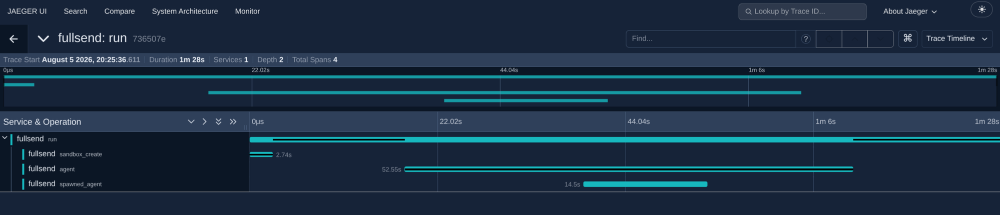

# 25. Subagent Process Isolation via PreToolUse Hooks

## Hypothesis

Claude Code's PreToolUse hooks can intercept `Agent()` calls and
replace the built-in subagent mechanism with an independent `claude`
CLI process running in the same sandbox. This would enable fullsend
to govern subagent workloads — particularly judge/evaluator agents
that need process isolation for accuracy — without waiting for native
multi-process support (fullsend#3978).

## Approach

Use a PreToolUse hook that:

1. Intercepts every `Agent()` tool call
2. Spawns a separate `claude -p` process with the original prompt
3. Replaces the Agent's prompt with an echo-through instruction
   containing the isolated process's result
4. The subagent faithfully echoes the result back as a clean
   `tool_result`

This avoids the denial-based approach (which is unreliable due to
bugs #24327, #59643, #29944) and the PostToolUse approach (which
doesn't fire for the Agent tool at all).

### Architecture

```
Parent Claude session
  │
  ├─ calls Agent(prompt="evaluate X")
  │
  ├─ PreToolUse hook intercepts
  │   ├─ spawns: claude -p "evaluate X" (isolated process)
  │   ├─ FULLSEND_HOOK_SPAWNED=1 prevents recursion
  │   ├─ waits for result (300s timeout)
  │   └─ returns updatedInput: prompt="echo this: {result}"
  │
  ├─ Subagent runs with echo-through prompt (cheap, fast)
  │
  └─ Parent receives clean tool_result
```

### Why 3 sessions instead of 2

The ideal flow would be: parent calls `Agent()` → hook runs the
work in an isolated process → result goes back to the parent.
That's 2 sessions. But PreToolUse hooks can only **modify** the
Agent tool's input — they cannot **prevent** the built-in subagent
from running. This means the flow is actually:

1. Parent calls `Agent(prompt="evaluate X")`
2. Hook spawns `claude -p "evaluate X"` → **session 2** (isolated)
3. Hook replaces the prompt with "echo this result back as-is"
4. Built-in subagent runs with the echo prompt → **session 3**
5. Parent receives the echoed result as a `tool_result`

Session 3 (the echo-through subagent) is cheap — it does no tool
calls, just parrots the text in a single turn — but it's an extra
inference call we can't avoid.

The two alternatives that would eliminate session 3 were both
ruled out:

- **PostToolUse `updatedToolOutput`** — could replace the result
  directly, but PostToolUse hooks do not fire for the Agent tool
  (experimentally confirmed)
- **Denial via `decision: "deny"`** — could block the built-in
  subagent entirely, but three independent bugs (#24327, #59643,
  #29944) make denial unreliable: the model stops acting, retries
  blindly, or never sees the deny reason

### Key discoveries

- **`updatedInput` does a full replace**, not a merge — all required
  Agent fields must be included
- **PostToolUse hooks do NOT fire for the Agent tool** — eliminates
  all PostToolUse-based approaches
- **Denial-based approaches are unreliable** — three independent bugs
  cause the model to stop, retry, or miss the deny reason
- **The echo-through pattern works** — subagent faithfully returns the
  isolated process's result as a clean `tool_result`
- **Hook config must use `settings.json`, not `settings.local.json`** —
  `--dangerously-skip-permissions` (used by fullsend) skips `.local`
  settings files. Inject via `host_files` to
  `/sandbox/claude-config/settings.json` (`CLAUDE_CONFIG_DIR`)
- **Spawned process cost requires explicit capture** — the spawned
  `claude -p` process's cost is invisible to fullsend's OTEL spans.
  Use `--output-format json` to get cost data, write it to
  `$FULLSEND_OUTPUT_DIR`, and emit a post_script OTEL span
- **Env files need `export`** — without it, vars are shell-local and
  child processes (including `claude`) don't inherit them
- **OpenShell L7 policies use application protocols** — `rest`, not
  `tcp`; and `access: read-write`, not `access: allow`

## Results

Confirmed working. A successful run produces:

- **3 output files**: `topic.md`, `evaluation.md`, `summary.md`
- **3 transcripts**:
  1. Parent session — orchestrates the task, calls `Agent()`
  2. Spawned `claude -p` process — does the actual evaluation work
     (distinct session ID, proving process isolation)
  3. Echo-through subagent — built-in subagent that receives the
     modified prompt and echoes the result back (shares the parent's
     session ID, does no real work)
- **`hook_success` event** in the parent transcript confirming the
  PreToolUse hook intercepted the `Agent()` call
- **`.spawned-cost.json`** in the output directory with the spawned
  process's cost and token usage
- **Cost**: ~$0.30 per run, ~90 seconds (parent $0.24 + spawned $0.06,
  spawned cost emitted as a separate OTEL span via post_script)

### Jaeger trace

All 4 spans under the same trace ID — the `spawned_agent` span
(emitted by the post_script) carries the isolated process's cost
and token usage:



## Conclusion

The PreToolUse echo-through pattern successfully isolates subagent
work into separate `claude` CLI processes within the same sandbox.
This is viable as a short-term mechanism for fullsend to support
judge/evaluator agents that need process isolation, until native
multi-process support lands via fullsend#3978.

The main trade-off is the extra echo-through subagent (session 3):
each intercepted `Agent()` call pays for one additional cheap
inference turn to shuttle the result back to the parent. This
overhead is small in practice but could be eliminated if Claude
Code added PostToolUse support for the Agent tool or a reliable
tool-result injection mechanism.

## File Layout

```
0025-subagent-process-isolation/
├── .fullsend/
│   ├── agents/
│   │   └── judge-parent.md      # Agent definition
│   ├── config.yaml              # Registers the agent
│   ├── config/
│   │   └── claude-hooks.json    # Hook config (injected via host_files)
│   ├── env/
│   │   └── gcp-vertex.env       # Vertex AI credentials (expanded into sandbox)
│   ├── harness/
│   │   └── judge-parent.yaml    # Harness definition (policy fetched from agents repo)
│   ├── hooks/
│   │   └── pretooluse.py        # The PreToolUse hook script
│   └── scripts/
│       ├── post-emit-cost.py    # Post-script: emits OTEL span for spawned cost
│       └── validate-output.sh   # Output validation
├── .gitignore                   # Excludes results/ and .fullsend-cache/
├── HOW_TO.md
└── README.md
```

## Troubleshooting

| Symptom | Cause | Fix |
|---------|-------|-----|
| `Not logged in · Please run /login` | Missing `CLAUDE_CODE_USE_VERTEX=1` or `export` keyword in env file | Ensure `gcp-vertex.env` uses `export` for all vars |
| `Could not refresh access token: policy_denied` | Network policy blocks OAuth token refresh | Use `protocol: rest` and `access: read-write` in policy; include `*.googleapis.com` |
| `harness file not found` | Missing `config.yaml` agent registration | Add `agents: [{source: harness/judge-parent.yaml}]` to `.fullsend/config.yaml` |
| `role field is required` | Harness missing `role:` field | Add `role: experiment` to harness YAML |
| `unknown protocol 'tcp'` | Old OpenShell policy format | Use `protocol: rest` instead of `protocol: tcp` |
| Hook doesn't fire | `settings.local.json` skipped in sandbox | `--dangerously-skip-permissions` ignores `.local` settings; use `settings.json` injected via `host_files` to `/sandbox/claude-config/settings.json` |
| Validation fails / no output files | Agent writes to wrong path | Agent must use `$FULLSEND_OUTPUT_DIR` (set to `/sandbox/workspace/output`) |
