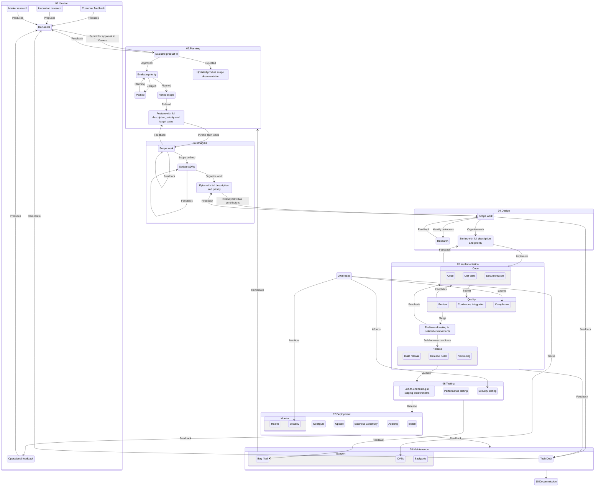

# Software Development Life Cycle (SDLC) Diagram

```mermaid
stateDiagram-v2
    direction TB

    state 01.Ideation {
        direction LR

        01customer: Customer feedback
        01innovation: Innovation research
        01market: Market research
        01ops: Operational feedback
        01document: Document

        01customer --> 01document: Produces
        01innovation --> 01document: Produces
        01market --> 01document: Produces
        01ops --> 01document: Produces
    }

    state 02.Planning {
        direction LR

        02fit: Evaluate product fit
        02prioritization: Evaluate priority
        02rejected: Updated product scope documentation
        02parked: Parked
        02scope: Refine scope
        02feature: Feature with full description, priority and target dates

        02fit --> 02rejected: Rejected
        02fit --> 02prioritization: Approved
        02prioritization --> 02scope: Planned
        02prioritization --> 02parked: Delayed
        02parked --> 02prioritization: Planning
        02scope --> 02feature: Refined
    }

    state 03.Analysis {
        direction LR

        03scope: Scope work
        03adrs: Update ADRs
        03epics: Epics with full description and priority

        03scope --> 03scope: Feedback
        03scope --> 03adrs: Scope defined
        03adrs --> 03adrs: Feedback
        03adrs -->  03epics: Organize work
    }

    state 04.Design {
        direction LR

        04scope: Scope work
        04research: Research
        04stories: Stories with full description and priority

        04scope --> 04research: Identify unknowns
        04research --> 04scope: Feedback
        04scope --> 04stories: Organize work
    }

    state 05.Implementation {
        direction LR

        state Code {
            05code: Code
            05test: Unit-tests
            05doc: Documentation
        }
        state Quality {
            05review: Review
            05ci: Continuous Integration
            05compliance: Compliance
        }
        05e2e: End-to-end testing in isolated environments
        state Release {
            05build: Build release
            05notes: Release Notes
            05versioning: Versioning
        }

        Code --> Quality: Submit
        Quality --> Code: Feedback
        Quality --> 05e2e: Merge
        05e2e --> Code: Feedback
        05e2e --> Release: Build release candidate
    }

    state 06.Testing {
        direction LR

        06e2e: End-to-end testing in staging environments
        06perf: Performance testing
        06security: Security testing
    }

    state 07.Deployment {
        direction LR

        07install: Install
        07config: Configure
        07update: Update
        07bc: Business Continuity
        07audit: Auditing
        state Monitor {
            Health
            Security
        }
    }

    state 08.Maintenance {
        direction LR

        08techdebt: Tech Debt
        state Support {
            08bug: Bug filed
            08cves: CVEs
            08backport: Backports
        }
    }

    09.InfoSec

    10.Decommission

    01document --> 02fit: Submit for approval to Owners
    02fit --> 01document: Feedback
    02feature --> 03scope: Involve tech leads
    03scope --> 02feature: Feedback
    03epics --> 04scope: Involve individual contributors
    04scope --> 03epics: Feedback
    04scope --> 08techdebt: Feedback
    04stories --> Code: Implement
    05.Implementation --> 08techdebt: Feedback
    05.Implementation --> 04stories: Feedback
    Release --> 06.Testing: Validate
    06.Testing --> 07.Deployment: Release
    06.Testing --> 08bug: Feedback
    07.Deployment --> 08.Maintenance: Feedback
    07.Deployment --> 01ops: Feedback
    08techdebt --> 01document: Remediate
    Support --> 02.Planning: Remediate
    09.InfoSec --> 05compliance: Informs
    09.InfoSec --> 06security: Informs
    09.InfoSec --> Security: Monitors
    09.InfoSec --> 08cves: Tracks
    08.Maintenance --> 10.Decommission
```
